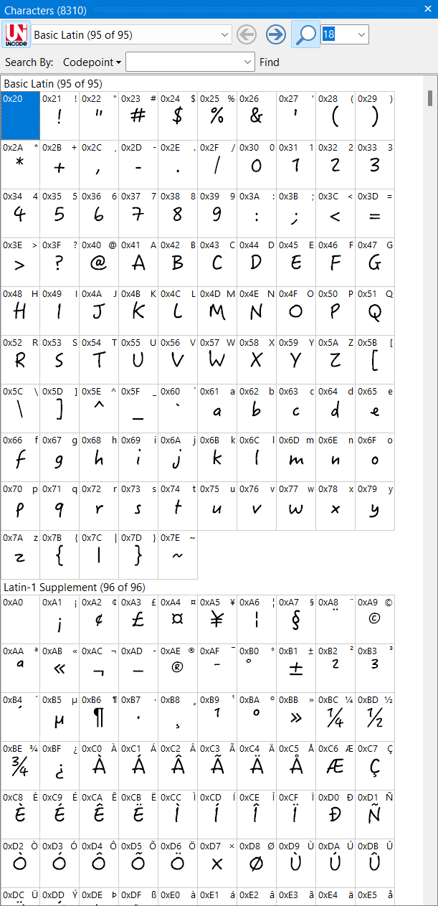
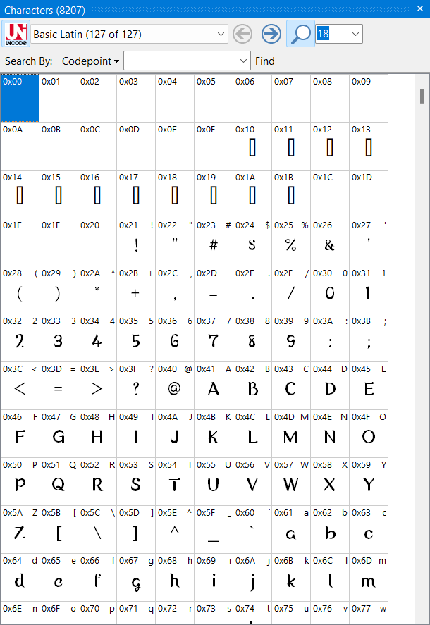
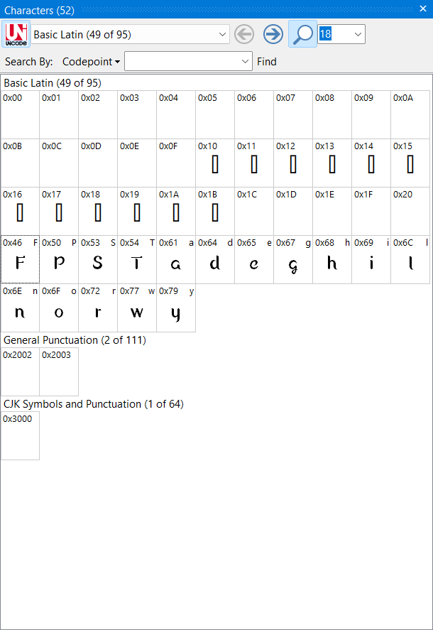

# Preview samples

## DFHanziPen Std W5
This is the font I'm currently using for [Niehime to Kemono no Ou](https://myanimelist.net/anime/46422/Niehime_to_Kemono_no_Ou) opening.  
I'm using it for the english and japanese versions (kanjis / kanas & romanization).

### Characters summary
|Full version|Stripped version|
|---|---|
|||

### Graphical render
I am using [mpv](https://mpv.io/) on both OS (Windows and Linux).  
On the left: Windows 11, font is **INSTALLED GLOBALLY**, not using the stripped version.  
On the right: Ubuntu 22.04, font is **NOT** installed, using the embedded stripped version.

|Windows (full version)|Ubuntu (stripped version)|
|:---:|:---:|
|||

## FOT-MatisseHatsuhi Pro B
This one is for the ending. As above, english, japanese kanjis / kanas & romanization.

### Characters summary
|Full version|Stripped version|
|---|---|
|||

### Graphical render

|Windows (full version)|Ubuntu (stripped version)|
|:---:|:---:|
|||

## A-OTF-Suzumushi Std M
This font was used on [Kunoichi Tsubaki no Mune no Uchi](https://myanimelist.net/anime/50338/Kunoichi_Tsubaki_no_Mune_no_Uchi), for typesetting the episodes titles.  
No kanjis or kanas were used here. This one was used for episode #3 with the following titles:
- Part A: *Friendly Showdown*
- Part B: *Play Tag*

### Characters summary
|Full version|Stripped version|
|---|---|
|||

### Graphical render
> **Note:** Because it wasn't a keyframe, I had to manually hit pause on mpv. Images may differ a bit -_-

|Windows (full version)|Ubuntu (stripped version)|
|:---:|:---:|
|||
